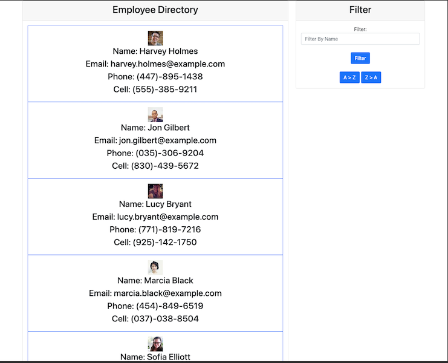
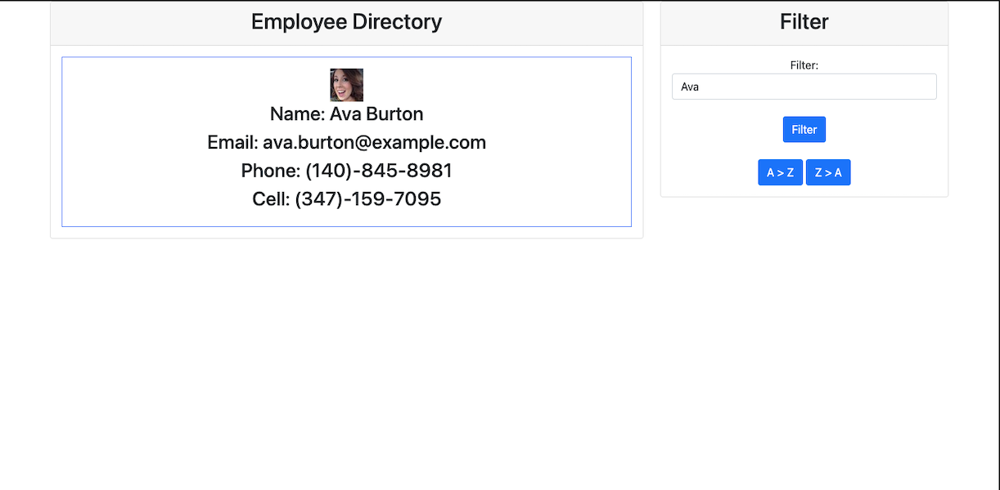
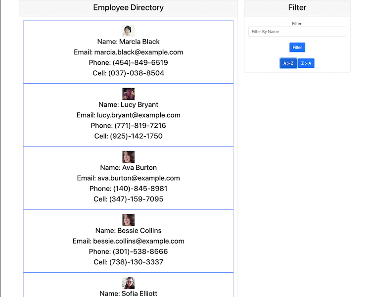

# employee-directory

## Description

    This app is a React based employee directory that allows employees
    or managers to view non-sensitive data about other employees.
    The Directory is populated by data from the Random User Generator API.

## Screenshots

## License

[MIT License](https://opensource.org/licenses/MIT)
